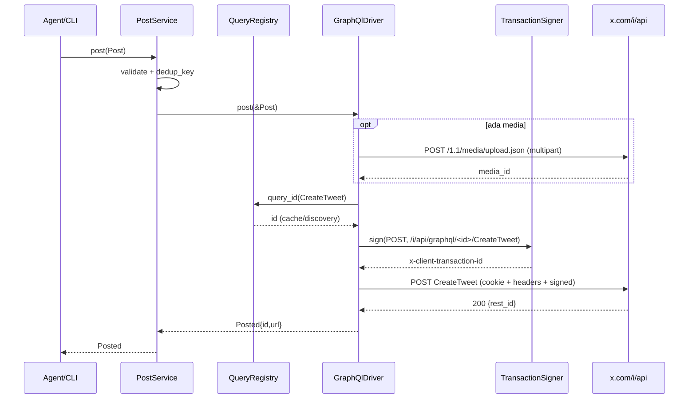
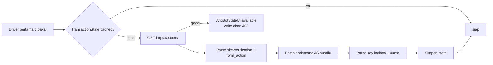
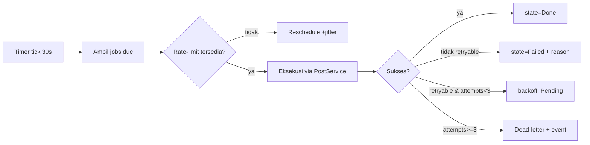

# X Headless — System Design

> **Headless control plane** untuk mengoperasikan akun X (Twitter) dari AI agent (Hermes, omp, Claude, dsb).
> Tanpa browser. Auth via **cookie**, transport **HTTP langsung ke endpoint internal X (GraphQL)**.
> Nama kerja: **xhl** (X Headless).

> **Klarifikasi scope (revisi)**: Proyek ini **bukan** headless *browser* seperti
> [moli](https://github.com/lexmount/moli) (yang merupakan runtime browser + CDP/WebDriver).
> Proyek ini adalah *headless client*: HTTP murni, tanpa Chromium, tanpa rendering.

---

## 1. Ringkasan & Tujuan

`xhl` adalah **core library** (`libxhl`) yang membungkus API internal X menjadi operasi domain
bermakna (`post`, `thread`, `search`, `timeline`, `analytics`, `schedule`, `draft`), lalu
mengeksposnya lewat **dua adapter tipis**: CLI dan MCP server (stdio).

| Dimensi | Keputusan |
|---|---|
| Stack | Rust (tokio async), `reqwest` |
| Akses X | HTTP/GraphQL langsung ke `x.com/i/api` |
| Auth | Cookie session (`auth_token`, `ct0`) — **bukan** login password, bukan Chromium |
| Anti-bot | `x-client-transaction-id` signer + TLS fingerprint impersonation |
| Interface | Core library + MCP (stdio) + CLI |
| Skala akun | Single akun dulu; kredensial per-akun sejak awal |
| Scope iterasi-1 | Posting, riset konten, analytics, scheduling, draft generation |

### 1.1 Non-goals

- Bukan runtime browser / mesin rendering (beda dengan moli).
- Bukan official API v2 client (tidak pakai API key X), walau `XApiDriver` disiapkan sebagai jalur alternatif.
- Bukan bot engagement massal / follower farming.
- Bukan multi-tenant SaaS; satu proses = satu akun aktif.

> ⚠️ **Risiko legal/ToS**: akses endpoint internal X dengan cookie melanggar ToS X dan akun dapat
> di-suspend. Batasi laju, jangan untuk spam. Ini keputusan eksplisit pemilik proyek.

---

## 2. Prinsip Desain

1. **Core bebas protokol.** `libxhl` tidak tahu MCP/CLI.
2. **Transport adalah detail.** `XDriver` trait + registry; `GraphQlDriver` (default), `XApiDriver` (future), `FakeDriver` (test).
3. **Cookie adalah sumber auth tunggal.** Tidak ada login otomatis, tidak ada password.
4. **Anti-bot ditangani eksplisit, bukan disembunyikan.** Signer transaction-id dan TLS impersonation adalah komponen bernama, dengan health-check dan observability.
5. **Persistensi lokal.** SQLite (WAL) untuk queue, draft, metrics, account roster.
6. **Aman-retry & idempoten.** Dedup key + marker untuk write.
7. **Fail loud.** `UnknownOutcome`/`Forbidden` dilaporkan apa adanya, tidak fallback diam-diam.

---

## 3. Arsitektur

```
┌──────────────────────────────────────────────────────────────┐
│                        Adapters (tipis)                      │
│   ┌────────────────┐              ┌──────────────────────┐   │
│   │  xhl (CLI)     │              │  xhl-mcp (MCP server)│   │
│   │  clap          │              │  rmcp, stdio         │   │
│   └───────┬────────┘              └───────────┬──────────┘   │
└───────────┼────────────────────────────────────┼──────────────┘
            │           libxhl (core)            │
   ┌────────▼────────────────────────────────────▼────────────┐
   │  Service: PostService │ ResearchService │ AnalyticsService│
   │           Scheduler   │ DraftService                       │
   ├──────────────────────────────────────────────────────────┤
   │  Domain: Tweet, Author, Media, Metrics, Draft, Job, Account│
   ├──────────────────────────────────────────────────────────┤
   │  XDriver trait + registry                                 │
   │   ├── GraphQlDriver  (default)                            │
   │   ├── XApiDriver     (future)                             │
   │   └── FakeDriver     (test)                               │
   ├──────────────────────────────────────────────────────────┤
   │  Transport/anti-bot:                                      │
   │   HttpClient (reqwest, cookie jar, header builder)        │
   │   TransactionSigner (x-client-transaction-id)             │
   │   ImpostorProfile (TLS/JA3 impersonation)                 │
   │   QueryRegistry (operation → queryId, auto-refresh)       │
   │   RateLimiter (header-driven) │ Retry/Backoff             │
   ├──────────────────────────────────────────────────────────┤
   │  Infra: AccountStore (cookie) │ Store(SQLite) │ tracing   │
   └────────┬─────────────────────────────────────┬───────────┘
            │                                     │
     ┌──────▼───────┐                    ┌────────▼────────┐
     │ x.com/i/api  │                    │  xhl.db (WAL)   │
     │ (GraphQL)    │                    └─────────────────┘
     └──────────────┘
```

### 3.1 Crate layout (Cargo workspace)

```
xhl/
├── Cargo.toml                 # [workspace]
├── crates/
│   ├── xhl-core/              # libxhl — TIDAK ada clap/rmcp
│   │   ├── src/domain/        # Tweet, Metrics, Post, Draft, Job, Account
│   │   ├── src/driver/        # XDriver trait, GraphQlDriver, FakeDriver
│   │   │   ├── graphql/       # operation definitions, response DTO, decoder
│   │   │   └── ...
│   │   ├── src/http/          # HttpClient, header builder, cookie jar wiring
│   │   ├── src/antibot/       # TransactionSigner, ImpostorProfile
│   │   ├── src/query/         # QueryRegistry (queryId discovery + bundle parse)
│   │   ├── src/limiter/       # RateLimiter (header-driven)
│   │   ├── src/store/         # sqlite + migrations
│   │   ├── src/service/       # post, research, analytics, schedule, draft
│   │   └── src/error.rs
│   ├── xhl-cli/               # bin "xhl"
│   └── xhl-mcp/               # bin "xhl-mcp"
└── docs/
```

Aturan dependensi: `xhl-core` MUST NOT depend pada `clap`/`rmcp`. Adapter → core, bukan sebaliknya.

---

## 4. Auth Model (Cookie)

### 4.1 Kredensial

| Cookie | Fungsi |
|---|---|
| `auth_token` | **Wajib**. Bukti sesi login akun. |
| `ct0` | **Wajib**. CSRF token; harus dikirim juga sebagai header `x-csrf-token`, nilainya identik. |
| `twid` | Opsional, dipakai sebagian endpoint. |

Cookie lain (`_twitter_sess`, `guest_id`, dll.) disimpan bila diimpor, tapi tiga di atas yang kritis.

### 4.2 Format impor

`xhl auth import` menerima:

1. **Netscape cookie file** — ekspor extension browser (`cookies.txt`).
2. **JSON array** — ekspor extension (field `name`/`value`/`domain`/`path`).
3. **String mentah** `name=value; name2=value2` — sesuai format `twscrape add_cookie`.

Validasi: `auth_token` dan `ct0` harus ada; `ct0` dipakai sebagai `x-csrf-token`.

### 4.3 Penyimpanan

- Cookie disimpan di **`xhl.db` tabel `accounts`** (kolom `cookies` JSON). Header PENTING:
  - SQLite TIDAK mengenkripsi file secara default. Untuk single-user, keamanan bergantung pada permission file (0600) + disk encryption OS.
  - Opsi hardening (pilih satu, lihat ADR-006):
    - **(a) SQLCipher path** — enkripsi penuh DB. Tidak sepenuhnya portabel dengan `rusqlite`.
    - **(b) `SecretStore` trait** — cookie di keyring OS; hanya pointer/alias di DB.
    - **(c) Plain file** mode 0600 (pragmatis, dipakai iterasi-1).
- `SecretStore` trait didefinisikan sejak awal agar (b) bisa diaktifkan tanpa refactor.
- Cookie **tidak pernah** muncul di log, tracing, output tool, atau pesan error. Redaksi wajib.

### 4.4 Health-check session

```
xhl auth status
  → GET /1.1/account/settings.json  (atau endpoint AccountSettings)
  → 200 + screen_name       : SessionStatus::Ok { screen_name }
  → 401/403                 : SessionStatus::Expired
  → app-level "not authorized": SessionStatus::Expired
```

Tidak ada refresh otomatis. Cookie kedaluwarsa → berhenti, minta impor ulang.

---

## 5. Transport & Anti-Bot Layer

### 5.1 Header builder

Setiap request ke `x.com/i/api` memerlukan set header browser-like:

```
authorization: Bearer <public web bearer>          # konstan, dari bundle web X
x-csrf-token: <nilai ct0>
x-twitter-auth-type: OAuth2Session
x-twitter-active-user: yes
x-twitter-client-language: en
user-agent: <UA Firefox/Chrome yang konsisten>
content-type: application/json
x-client-transaction-id: <hasil signer>            # WAJIB
cookie: auth_token=...; ct0=...; ...
```

- Public bearer diperlakukan sebagai **konstanta versi** yang bisa berubah; disimpan di config bundle + dapat di-refresh (lihat §5.3).
- Transaction-id **wajib**: tanpa / salah → `403`. Ini penyebab kegagalan #1.

### 5.2 Transaction signer (`antibot::TransactionSigner`)

Algoritma (mengacu implementasi publik `XClientTransaction` Python / `x-client-transaction` Rust):

1. Ambil `https://x.com/` → ekstrak `<meta name="twitter-site-verification">` (kunci) + `form_action`.
2. Ambil file ondemand JS (`ondemand.s` / bundle) → ekstrak daftar indeks byte key + kurva animasi (cubic curve) + nilai rotasi.
3. Buat signature dari kombinasi **method + path** request menggunakan interpolasi kurva + `sha256` + `base64`.

Desain kode:

```rust
pub struct TransactionState { /* kunci, indeks, kurva — hasil parsing */ }

pub trait TransactionSigner: Send + Sync {
    /// `method` GET/POST, `path` = path GraphQL (tanpa query string)
    fn sign(&self, method: Method, path: &str) -> Result<String, XhlError>;
}

pub struct HttpTransactionSigner { state: RwLock<TransactionState>, /* … */ }
```

- **Bootstrap lazy**: state di-fetch sekali per proses (dan di-cache), tidak tiap request.
- **Refresh terjadwal**: state di-refresh saat 403 menandakan nilai basi, atau tiap N jam.
- **Fallback**: bila bootstrap gagal, driver tetap jalan tapi write/GraphQL akan 403 → error `AntiBotStateUnavailable` yang jelas (tidak silent).

> **Keputusan dependensi**: pakai crate `x-client-transaction` 0.1.0 (MIT) sebagai **rujukan algoritma**.
> Karena masih 0.1.0 dan memakai `reqwest` blocking, kita **vendorkan implementasi minimal** ke
> `xhl-core/src/antibot/` (algoritmanya kecil: cubic curve + interpolate + rotation + sha256/base64),
> supaya tidak terikat versi & bisa async-native. Lihat ADR-007.

### 5.3 QueryRegistry (queryId)

Endpoint GraphQL berbentuk:

```
POST https://x.com/i/api/graphql/{queryId}/{OperationName}
```

`queryId` **berotasi** saat X meng-update bundle web. Strategi:

| Sumber | Deskripsi | Perilaku |
|---|---|---|
| `known_queries.json` | Bundle query name→id yang di-vendor & di-update saat rilis | Dipakai duluan (cepat, offline) |
| **Discovery** | Fetch bundle JS X → regex ekstrak pasangan `{operationName, queryId}` | Menyegarkan registry saat dijalankan, cache ke DB |
| **Env/override** | `XHL_QUERY_IDS=/path.json` | Untuk memperbaiki tanpa rilis baru |

Aturan:
- `404` pada satu karena queryId usang → refresh discovery **sekali**, retry, lalu gagal dengan `QueryIdStale { operation }`.
- Setiap operasi menyimpan `last_good_query_id` agar fallback cepat.

Operasi yang dibutuhkan (nama kanonik X):

| Operation | Dipakai untuk |
|---|---|
| `CreateTweet` | Posting tweet |
| `CreateRetweet` / `DeleteRetweet` | Repost (opsional) |
| `SearchTimeline` | Search & trends/query |
| `HomeTimeline` / `HomeLatestTimeline` | Timeline home |
| `UserTweets` | Timeline user |
| `TweetDetail` | Thread / balasan |
| `UserByScreenName` | Resolve handle → user id |
| `FavoriteTweet` / `DeleteFavorite` | Like (opsional) |
| `AccountSettings` / health endpoint | Health-check session |
| `UploadMedia` (`/1.1/media/upload.json`) | Upload media (REST, multipart) |

### 5.4 TLS fingerprint (`antibot::ImpostorProfile`)

- Cloudflare/X memperhatikan JA3/JA4 TLS fingerprint. `reqwest` default Rustls/OpenSSL sering ditandai.
- Jalur utama: pakai **`rquest`** (fork reqwest dengan impersonasi TLS; API mirip reqwest) dengan profil browser yang cocok dengan `user-agent` yang dikirim.
- Jalan keluar: jika integrasi `rquest` menyulitkan, gunakan `reqwest` + rustls dan uji; bila 403 fingerprint muncul, ganti (ADR-008).
- **Konsistensi wajib**: profil TLS, `user-agent`, dan header lain harus berasal dari **satu deskripsi profil** untuk menghindari inkonsistensi yang justru menandai bot.

### 5.5 Rate limiter

X mengembalikan header `x-rate-limit-limit`, `x-rate-limit-remaining`, `x-rate-limit-reset`
(per endpoint, per user). Limiter **berbasis header**:

- Simpan bucket per `operation` (endpoint bucket).
- Sebelum request: bila `remaining == 0` → tunggu sampai `reset` (dengan jitter).
- `429` tanpa header → backoff eksponensial adaptif.
- Budget global tambahan (konservatif) untuk write agar agresivitas dibatasi.

---

## 6. Model Domain

```rust
pub struct TweetId(String);
pub struct Handle(String);
pub struct AccountId(String);

pub struct Account {
    pub id: AccountId,
    pub handle: Option<Handle>,       // terisi setelah health-check
    pub user_id: Option<String>,      // rest_id dari UserByScreenName
    // cookies TIDAK di struct ini — diambil dari SecretStore/DB saat dibutuhkan
}

pub struct Tweet {
    pub id: TweetId,
    pub author: Author,
    pub text: String,
    pub created_at: time::OffsetDateTime,
    pub media: Vec<Media>,
    pub metrics: Option<Metrics>,
    pub url: String,
}

pub struct Metrics {
    pub likes: Option<u64>, pub reposts: Option<u64>, pub replies: Option<u64>,
    pub views: Option<u64>, pub bookmarks: Option<u64>,
}

pub struct Author { pub handle: Handle, pub display_name: String, pub verified: bool }

pub enum Media { Image { path: PathBuf, alt: Option<String> }, Video { path: PathBuf, alt: Option<String> } }

pub struct Post { pub text: String, pub media: Vec<Media>, pub reply_to: Option<TweetId> }
pub struct Posted { pub id: TweetId, pub url: String, pub posted_at: OffsetDateTime }

pub enum JobState { Pending, Running, Done, Failed { reason: String }, Cancelled }
pub struct Job { pub id: Uuid, pub run_at: OffsetDateTime, pub payload: JobPayload, pub state: JobState, pub attempts: u32 }
pub enum JobPayload { Post(Post), Thread(Vec<Post>) }
```

---

## 7. Driver Layer

```rust
#[async_trait::async_trait]
pub trait XDriver: Send + Sync {
    async fn health(&self) -> Result<SessionStatus, XhlError>;

    async fn post(&self, p: &Post) -> Result<Posted, XhlError>;
    async fn upload_media(&self, m: &Path) -> Result<MediaRef, XhlError>;

    async fn search(&self, q: &SearchQuery) -> Result<Vec<Tweet>, XhlError>;
    async fn timeline(&self, t: TimelineKind, cursor: Option<Cursor>) -> Result<Page<Tweet>, XhlError>;
    async fn thread(&self, id: &TweetId) -> Result<Vec<Tweet>, XhlError>;
    async fn tweet_metrics(&self, id: &TweetId) -> Result<Metrics, XhlError>;
}
```

`GraphQlDriver` mengimplementasikannya dengan:

1. Resolve operation → `queryId` (QueryRegistry).
2. Bangun payload GraphQL (`variables`, `features`, `fieldToggles`) — X mensyaratkan objek `features` lengkap; disimpan sebagai konstanta berversi.
3. Sign transaction-id untuk `(method, path)`.
4. Kirim via `HttpClient` (cookie jar + header builder).
5. Decode respons → DTO → domain. Header respons memberi update rate limiter.

Posting adalah **dua langkah** bila ada media: `UploadMedia` (multipart, dapat `media_id`) → `CreateTweet` dengan `media.media_entities`.

---

## 8. Store (SQLite)

```sql
-- accounts: kredensial & identitas
CREATE TABLE accounts (
  id TEXT PRIMARY KEY, handle TEXT, user_id TEXT,
  cookies TEXT NOT NULL,             -- JSON (lihat §4.3; bisa jadi alias keyring)
  created_at TEXT NOT NULL, updated_at TEXT NOT NULL
);

CREATE TABLE jobs (
  id TEXT PRIMARY KEY, account TEXT NOT NULL, run_at TEXT NOT NULL,
  payload TEXT NOT NULL, state TEXT NOT NULL, attempts INTEGER NOT NULL DEFAULT 0,
  dedup_key TEXT, idempotency_marker TEXT, created_at TEXT NOT NULL, updated_at TEXT NOT NULL
);
CREATE INDEX idx_jobs_due ON jobs(state, run_at);

CREATE TABLE drafts (
  id TEXT PRIMARY KEY, account TEXT NOT NULL, body TEXT NOT NULL, name TEXT,
  origin TEXT NOT NULL, created_at TEXT NOT NULL
);

CREATE TABLE metrics_snapshots (
  tweet_id TEXT NOT NULL, captured_at TEXT NOT NULL,
  likes INTEGER, reposts INTEGER, replies INTEGER, views INTEGER, bookmarks INTEGER,
  PRIMARY KEY (tweet_id, captured_at)
);

CREATE TABLE query_ids (            -- hasil discovery, cache lintas run
  operation TEXT PRIMARY KEY, query_id TEXT NOT NULL, source TEXT NOT NULL, observed_at TEXT NOT NULL
);

CREATE TABLE session_events (
  at TEXT NOT NULL, account TEXT NOT NULL, kind TEXT NOT NULL, detail TEXT
);
```

WAL, `busy_timeout`, migrasi `user_version`. Operasi SQLite dibungkus `spawn_blocking`
(tidak ada blocking di jalur async).

---

## 9. Service Layer

| Service | Tanggung jawab | Bergantung pada |
|---|---|---|
| `PostService` | Text/thread/media, validasi, dedup, baca ID hasil dari respons | XDriver, RateLimiter |
| `ResearchService` | Search + filter, timeline, ekspansi thread | XDriver, RateLimiter |
| `AnalyticsService` | Ambil metrics, simpan snapshot, hitung delta | XDriver, Store |
| `Scheduler` | Job due, eksekusi, retry/backoff, dead-letter | Store, PostService |
| `DraftService` | CRUD draft + hook LLM | Store, LlmProvider |

### 9.1 Idempotensi

- `PostService` membuat `dedup_key` (hash teks+media+reply_to+tanggal) dan menyimpan
  `idempotency_marker`. Job dengan dedup sama & state `Done` tidak dieksekusi ulang.
- Bila request terkirim tapi respons hilang (`UnknownOutcome`), **tidak** auto-retry;
  kembalikan petunjuk verifikasi (`xhl search "from:me <teks>"`).

### 9.2 Retry policy

| Error | Perilaku |
|---|---|
| `Network`, `Timeout` | Retry eksponensial, maks 3 |
| `RateLimited { retry_after }` | Hormati reset; reschedule; tidak retry langsung |
| `Forbidden { reason: Csrf }` | Refresh `ct0` dari store (bila berubah) lalu 1x retry; gagal → hard error |
| `Forbidden { reason: TransactionId }` | Refresh `TransactionState` lalu 1x retry |
| `Forbidden { reason: Tls }` / `Suspicious` | Longgarkan laju, tidak retry; tandai sesi berisiko |
| `QueryIdStale` | Refresh registry (discovery) 1x, retry |
| `AuthExpired` | Stop semua write; minta `xhl auth import` |
| `UnknownOutcome` | Tidak retry |

### 9.3 Draft generation (LLM)

`LlmProvider` trait (`NullProvider` default, `OpenAiCompatProvider` via `reqwest`).
Draft LLM **selalu** masuk `drafts` dengan `origin='llm'` dan **tidak pernah** langsung diposting.
Posting draft = aksi eksplisit terpisah.

---

## 10. Adapter: MCP Server (`xhl-mcp`)

MCP (rmcp 3.x, stdio) mengekspos operasi core sebagai tool.

| Tool | Scope | Deskripsi |
|---|---|---|
| `xhl_post` | Posting | Posting tweet tunggal |
| `xhl_thread` | Posting | Posting rangkaian (thread) |
| `xhl_post_with_media` | Posting | Post + media (path lokal di-upload) |
| `xhl_post_from_draft` | Posting | Posting dari draft tersimpan |
| `xhl_search` | Riset | Cari tweet (query, limit, filter) |
| `xhl_timeline` | Riset | Home/following/user timeline |
| `xhl_thread_read` | Riset | Ambil isi thread |
| `xhl_trends` | Riset | Trend yang tersedia |
| `xhl_user_lookup` | Riset | Resolve handle → profil singkat |
| `xhl_metrics` | Analytics | Metrics satu tweet |
| `xhl_metrics_history` | Analytics | Delta metrics dari snapshot lokal |
| `xhl_draft_create` | Draft | Simpan draft |
| `xhl_draft_generate` | Draft | Generate draft via LLM provider |
| `xhl_draft_list` | Draft | List draft |
| `xhl_schedule_post` | Scheduling | Jadwalkan post (RFC3339) |
| `xhl_schedule_list` | Scheduling | List job terjadwal |
| `xhl_schedule_cancel` | Scheduling | Batalkan job (butuh `confirm: true`) |
| `xhl_session_status` | — | Health session (read-only) |

Prinsip adapter:

- Validasi input di boundary MCP; error dipetakan dengan pesan actionable.
- Tool write menyebut konsumsi rate-limit di deskripsi (`"consumes: 1 write"`).
- Tool destruktif butuh `confirm: true`.
- Satu proses MCP = satu akun aktif; kelak argumen `account`.
- **Cookie tidak pernah** masuk atau keluar lewat MCP. Agent tidak dapat melihat/menyetel kredensial.

Konfigurasi agent:

```json
{ "mcpServers": { "xhl": { "command": "xhl-mcp", "args": ["--account", "default"] } } }
```

### 10.1 Adapter: CLI (`xhl`)

```bash
xhl auth import [--account default] [--from cookies.txt|json|stdin]
xhl auth status
xhl post "text" [--media f.jpg] [--reply-to <id>]
xhl thread --file thread.json
xhl search "rust async" --limit 20 --json
xhl timeline --kind home --limit 20
xhl user --handle jack
xhl metrics <tweet-id> [--watch 6h]
xhl draft new --name "launch" --body "..."
xhl draft generate --prompt "..."
xhl schedule post --at "2026-10-01T09:00:00+07:00" --draft <id>
xhl run [--once]              # daemon scheduler
xhl doctor                    # cek cookie, signer, queryId, rate-limit budget
```

`xhl doctor` adalah perintah diagnostik first-class: melaporkan status tiap komponen anti-bot
(cookie valid?, bootstrap signer sukses?, queryId ter-resolve?, fingerprint profil?).

---

## 11. Alur Kritis

### 11.1 Posting



Kegagalan setelah request terkirim tanpa respons → `UnknownOutcome`, tidak retry.

### 11.2 Bootstrap anti-bot (lazy, sekali per proses)



### 11.3 Scheduler



---

## 12. Error Model

```rust
#[derive(Debug, thiserror::Error)]
pub enum XhlError {
    #[error("session kedaluwarsa: {0}")] AuthExpired(String),
    #[error("dilarang ({reason}): {detail}")] Forbidden { reason: ForbiddenReason, detail: String },
    #[error("queryId '{operation}' usang")] QueryIdStale { operation: &'static str },
    #[error("state anti-bot tidak tersedia: {0}")] AntiBotStateUnavailable(String),
    #[error("rate limited, reset dalam {retry_after:?}")] RateLimited { retry_after: Duration },
    #[error("network: {0}")] Network(String),
    #[error("timeout pada {stage}")] Timeout { stage: &'static str },
    #[error("hasil tidak diketahui untuk write: {hint}")] UnknownOutcome { hint: String },
    #[error("validasi: {0}")] Invalid(String),
    #[error("konfigurasi: {0}")] Config(String),
    #[error("internal: {0}")] Internal(String),
}

pub enum ForbiddenReason { Csrf, TransactionId, Tls, Suspicious, Unknown }
```

Setiap varian punya pemetaan eksplisit: retryable?, butuh manusia?, aman untuk agent?

---

## 13. Kebutuhan Non-Fungsional

| Aspek | Target |
|---|---|
| Startup MCP | < 300 ms (tanpa bootstrap anti-bot; lazy saat tool pertama) |
| Latency `post` | tipikal 150–600 ms + waktu upload media |
| Binary size | jauh lebih kecil dari pendekatan browser (~5–10 MB release, LTO) |
| Observability | `tracing` JSON ke stderr (MCP) / file (CLI `run`); metrik per-komponen anti-bot |
| Crash safety | job state transaksional; `Running` stale (>5 mnt) direset ke `Pending` |
| Secret handling | cookie tidak pernah di log/error/tool output; redaksi wajib; mode file 0600 |
| Portabilitas | Linux utama; Windows/macOS menyusul |

---

## 14. ADR

- **ADR-001 — Cookie + endpoint internal, bukan official API.** Bebas biaya, bisa write & read. Konsekuensi: ToS risiko, rapuh terhadap perubahan X.
- **ADR-002 — Tanpa Chromium.** Bukan runtime browser; hanya HTTP. Menghilangkan biaya memori/CPU & kompleksitas CDP. (Revisi dari ADR sebelumnya yang memakai CDP.)
- **ADR-003 — Core library + adapter tipis.** Logika domain tidak terduplikasi; CLI & MCP memakai service sama.
- **ADR-004 — SQLite single-file.** Cukup untuk queue, draft, metrics, cache queryId, roster akun.
- **ADR-005 — Single akun dulu; `account` ada di skema/tipe sejak awal.**
- **ADR-006 — Cookie di DB plaintext (mode 0600) untuk iterasi-1, dengan `SecretStore` trait siap untuk keyring/SQLCipher.** Alternatif dinilai: SQLCipher (kompleks, portabilitas) vs keyring (UX lebih rumit, tapi paling aman).
- **ADR-007 — Vendor implementasi transaction signer**, jangan depend ke crate 0.1.0 (blocking reqwest, API belum stabil). Algoritma dirujuk dari implementasi publik.
- **ADR-008 — `rquest` (TLS impersonation) sebagai client default**, dengan `reqwest` sebagai fallback bila integrasi bermasalah. Konsistensi UA/TLS wajib.
- **ADR-009 — LLM hanya menghasilkan draft**, tidak ada jalur otomatis generate→post.

---

## 15. Roadmap Teknis

| Milestone | Isi | DoD (bukti) |
|---|---|---|
| M1 Skeleton | Workspace, domain types, `FakeDriver`, CLI `search` offline | `cargo test -p xhl-core` hijau; CLI jalan pakai fake driver |
| M2 Auth & Session | `auth import`, `accounts` store, health-check | Cookie nyata terimpor; `xhl auth status` melaporkan `Ok { screen_name }` |
| M3 HTTP Read | HttpClient + header builder + rate limiter; `UserByScreenName`, `SearchTimeline` | `xhl user --handle <x>` & `xhl search` mengembalikan data nyata |
| M4 Anti-bot | TransactionSigner (vendored) + QueryRegistry + `xhl doctor` | `xhl doctor` melaporkan semua komponen hijau; request GraphQL tidak 403 |
| M5 Write | `UploadMedia` + `CreateTweet`; dedup & idempotensi | Post nyata tampil di X, ID terverifikasi dari respons |
| M6 MCP adapter | Semua tool read + write | Agent MCP memanggil `xhl_search`/`xhl_post` berhasil |
| M7 Analytics | Metrics + snapshot + delta | `xhl metrics --watch` menghasilkan histori |
| M8 Scheduling | Daemon `xhl run` | Job terjadwal tereksekusi; retry & dead-letter teruji |
| M9 Draft/LLM | DraftService + provider | Draft dari LLM tersimpan; `post_from_draft` bekerja |
| M10 Hardening | TLS impersonation final, observability, dokumentasi operasional | 403-rate turun; runbook insiden tersedia |

> M4 (anti-bot) sengaja **sebelum** M5 (write) karena write adalah operasi yang paling diawasi
> dan paling mahal bila gagal (risiko suspend).

---

## 16. Dependency (diverifikasi 2026-09-29)

Versi adalah hasil cek `crates.io` saat dokumen ditulis; **selalu** konfirmasi ulang via `cargo add`.

| Crate | Versi dicek | Catatan |
|---|---|---|
| `tokio` | 1.53 | runtime async |
| `reqwest` | 0.13 | HTTP dasar (fallback); cookie store |
| `rquest` | 5.2 (rilis 2025-07) | TLS/JA3 impersonation; API mirip reqwest. **Verifikasi kompatibilitas saat implementasi** |
| `rmcp` | 3.5.0 | official Rust MCP SDK, stdio |
| `rusqlite` | 0.40 | SQLite (`bundled`) |
| `clap` | 4.6 | CLI derive |
| `serde`/`serde_json` | 1.0 | serialisasi |
| `thiserror` | 2.x | error enum |
| `tracing` | 0.1 | observability |
| `time` | 0.3 | waktu (`OffsetDateTime`) |
| `uuid` | 1.x | ID job/draft |
| `rand` | 0.9 | jitter |
| `sha2` + `base64` + `regex` + `scraper` | — | transaction signer (vendored) |
| `keyring` | 4.2 | opsional, `SecretStore` |
| `x-client-transaction` | 0.1.0 | **rujukan algoritma** (tidak di-depend) |
| `agent-twitter-client` | 0.1.2 | rujukan implementasi cookie-based |
| `twscrape` (Python) | — | rujukan format cookie & header |